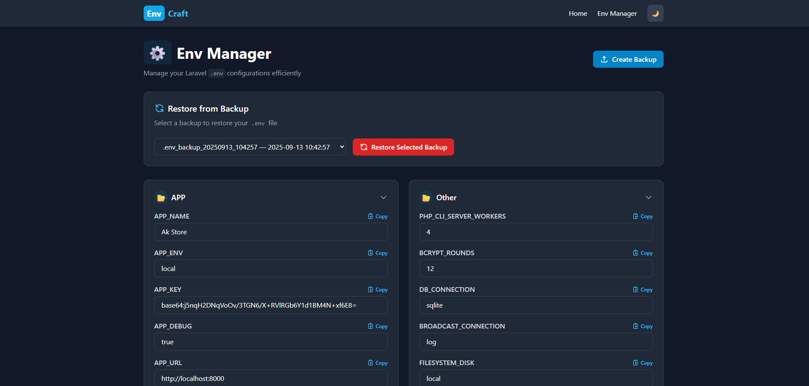
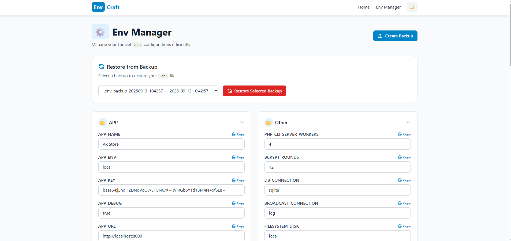

# EnvCraft

A Laravel package to manage `.env` values via a modern Tailwind-based UI or Artisan commands, with full backup and restore functionality.

## Installation

```bash
composer require areia-lab/env-craft
```

## Publish Vendor Assets

### Config

```bash
php artisan vendor:publish --tags="craft-config"
```

### Views

```bash
php artisan vendor:publish --tags="craft-views"
```

## Usage

### Web UI

Visit `/admin/env-manager` in your Laravel application to access the EnvCraft UI.





### Artisan Commands

#### Backup

- Create a backup:

```bash
php artisan env:backup
```

- Create a backup with directory details:

```bash
php artisan env:backup -d|--details
```

#### List Backups

```bash
php artisan env:backup-list
```

#### Show .env Values

- Show all key-value pairs:

```bash
php artisan env:show
```

- Show a specific key:

```bash
php artisan env:show --key=APP_KEY
# or
php artisan env:show -k APP_KEY
```

#### Set .env Values

- Interactive prompt:

```bash
php artisan env:set
```

- Set key and value directly:

```bash
php artisan env:set --key="TEST_KEY" --value="Abc123"
```

#### Restore Backups

- Restore from a backup (interactive list):

```bash
php artisan env:restore --show
```

- Restore from a predefined backup file path:

```bash
php artisan env:restore C:\laragon\www\packages\laravel-env-editor\storage\app\backup\env-backups\.env_backup_20250913_104031
```

#### Delete Backups

- Delete a specific backup:

```bash
php artisan env:backup-delete --file="/storage/app/backup/env-backups/.env_backup_20250913_141200"
```

- Delete all backups:

```bash
php artisan env:backup-delete --all
```

- Delete previous N backups (excluding latest):

```bash
php artisan env:backup-delete --pre=10
```

- Interactive delete (choose from latest 10 backups):

```bash
php artisan env:backup-delete
```

---

This package is fully compatible with **Laravel 9–12** and ensures safe `.env` management with backup/restore mechanisms.
